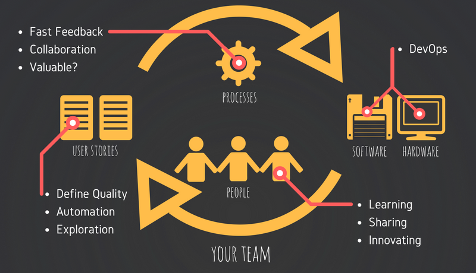
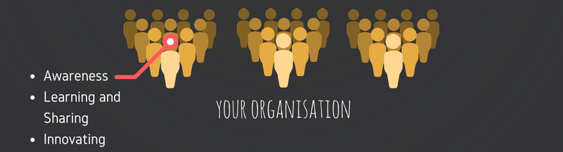
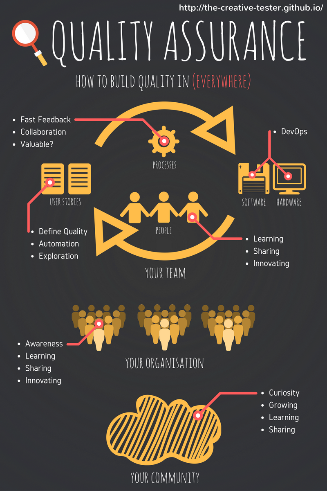

## How To Build Quality In (Everywhere)

### Introduction

I was recently asked what I see my role is in the Quality Assurance field.  I often see other QAs (Test Analysts, Test Engineers, Quality Analysts, Quality Engineers, etc.) in the industry restricting themselves to only caring about the quality of individual user stories, and in the rare case this may extend to caring about the overall software that is being delivered.  This is of course could be due to a number of limitations such as inexperience, bandwidth or even from a lack of interest.  

I believe that as a QA, there is so much more to offer, and that you can be an advocate of quality for not only user stories and software, but also the hardware, people and processes that are required to deliver a final product.  I also feel that we can contribute on a larger scale than just within the team, whether it be internal or external to the organisation that you are employed at.  

In this post, I will attempt to briefly describe the points that we should look to be driving on a day-to-day basis in our team, in our organisation and in our community.

### Your Team

Your team is the first place where you can be an advocate for all things related to quality.  This is where everything that you do will ultimately contribute to the delivery of a higher quality product.  In order to achieve this, we must first look at how we can build quality into 4 different areas, User Stories, Processes, People as well as Software and Hardware.

{: .center-image }

#### User Stories

1. **Defining Quality**

   One of the first things that I was ever taught to do was to be able to facilitate a discussion on the definition of quality.  This definition can apply to an user story, a feature or even for the whole project.  The definition of quality that I once heard is that _"quality is some value to some person at some point in time_".  The role of the QA is to ensure that all relevant characteristics (or value) of what makes up quality is discussed and included in the user story.  Common examples that I have always had to deal with, include, Correctness, Performance, Security, Compatibility and Maintainability.  Knowing the scope of these characteristics will often help drive discussions around the correct acceptance criteria to be included in the user story, or even identifying what is needed at a feature or project level.
2. **Automation**  

   Compared to a human, a machine is less likely to make mistakes in checking a given set of steps or instructions.  It is regularly discussed that the role of a QA is a combination of checking (automation) and testing (exploration).  With this in mind, it is often best to automate the highly repetitive _checking_ tasks.  As a QA, you want to ensure the right amount of tests are written at the right level.  You want to also ensure that both the most riskiest items from a business and technical point of view are automated.  As per the previous point, it is not only the Correctness characteristic that can be automated.  It is very possible to automate the likes of Security, Performance and Compatibility testing.
3. **Exploration**
   
   With a well-rounded knowledge of the customer and the technology that has been delivered, a QA has the ability to perform exploratory testing.  With the boring, repetitive testing now automated, a QA can spend their time performing the more valuable exploratory testing.  Exploratory testing is often known as simultaneous learning, test design, and test execution for a piece of software.

#### Processes

1. **Fast Feedback**

   In every project that I have been part of, I always strive to ensure that everything we do has short feedback cycles.  This includes our automated tests always running in CI, frequent shoulder checks, frequent kick offs, frequent sign offs, frequent showcases, but most importantly small user stories.  I also often try to remove the reliance on stand ups, showcases and retrospectives to give feedback.  These ceremonies are simply placeholders to ensure that _some_ feedback happens, but often there is a much earlier time to do this.  The faster our feedback, the faster we can react to something that has gone wrong.
2. **Collaboration**
  
   Unfortunately, I often find it the role of a QA to gather all stakeholders at each step of the story lifecycle.  This is often done through shoulder checks, kick offs, sign offs or even during showcases.  However, each of these steps is important to ensure that the team has  a shared understanding of what we are building.  This shared understanding will allow us to prevent potential bugs from ever being created, and will prevent the possibility of requirements not being delivered.  I've found that using techniques such as BDD or Three Amigos can help facilitate collaboration.
3. **Valuable?**

   Questioning the value of project activities or decisions.  I often find myself in the position of trying to minimise as much waste as possible so that time can be spent on building more features or performing exploratory testing.

#### People

1. **Learning and Sharing**
   
   You will often spend up to 8 hours a day with some of your teammates, and I believe that building a quality relationship can help foster an environment where you can learn and share with each other.  A project team often has a diverse selection of people, backgrounds and roles.  This means that every interaction you have is an opportunity to learn something new.  Learn a bit more about a particular technology from a Software Engineer or learn a bit more about the business or product from a Business Analyst or Product Analyst.  Always share what you have learnt to others.

#### Software and Hardware

1. **DevOps**

   This is a particularly new area for me, but with the move towards infrastructure as code, it is another area that we will often have to apply QA techniques to ensure correctness, maintainability and repeatability.  The creation of an environment often involves the provisioning of hardware and the deployment of software.  A QA often knows the many testing related activities that are going on in a project (e.g., Training, Performance Testing, Security Testing, User Testing) so often they are in the best position to know what needs to be provisioned and when it is needed.  Ensuring an adequate process is in place to repeatedly create these environments with the suitable requirements will help with the environment management.

### Your Organisation

Next, your organisation is a place where you can learn and share what other areas are doing in the Quality Assurance field.  This is a place where you are able to build quality into people from teams other than your own through knowledge sharing and diverse discussions. 

{: .center-image }

1. **Awareness**

   I often find myself proactively reaching out to areas of my organisation about some of the services that the team can offer.  With the _automate everything_ approach now such a big part of our day-to-day work, who knows what other areas of the organisation could use that type of thinking.  Also, with automated testing and early collaboration, it may potentially remove the need for many duplicated testing related activities (e.g., UAT) to occur.  By educating our stakeholders, we have the ability to remove this waste and instead spend our time on more valuable activities.
2. **Learning and Sharing**
 
   It is also important to reach out to other areas of the organisation in the same field as you.  There is great value in establishing a community or forum for QAs across an organisation who are working on different projects.  These communities can facilitate knowledge sharing and learning of the different tools and technologies used across an organisation, but can also facilitate conversations around problems faced by one team may have already been solved by another.  Always share what you have learnt to others.

3. **Innovating**

   Innovation days are a great way to trial a new tool or technology.  Often with project schedules, there isn't always the time to experiement on something not relevant to your project, however, in the last few innovation days I have had the chance to work on Visual Regression Testing, Mobile Testing and also a bit in the DevOps space.

### Your Community

Next, your community is a place where you can learn and share what other organisations are doing in the Quality Assurance field.  It is a place where you can see and learn from a diverse range of industries and backgrounds, but it also gives you the opportunity to give back to the community and the next generation of professionals in the field of Quality Assurance.

{: .center-image }

1. **Best?**

   One of my mentors once asked me "_what does the best QA team look like_".  This question should always remain in the back of your mind, and it is likely to be the biggest contributor for your desire and curiosity to learn and know more.  However, in order to know what _best_ looks like, you need to follow  trends in the industry, which ultimately means being active in the community.  This could be through reading blogs, attending meetups or attending conferences.  In my experience, most of the time that I find out about a new technique or a new technology it is through one of these mediums.
2. **Community Growth**
 
   If you feel comfortable, it is also important to share some of your experiences and knowledge to others in the QA community.  There are many forums where you can do this, such as at meetup events, conferences, but also try reaching out to a local university to see if you can impart some of your knowledge to students.  Your experience in the industry can help bridge the gap between what is taught from a theoretical perspective and what is performed in practice by talking to students who are looking to pursue a career in Quality Assurance.
3. **Learning and Sharing**

   As mentioned before, learn through reading blogs, attending meetups or attending conferences.  Always share what you have learnt to others.

### Full Infographic

{: .center-image }
