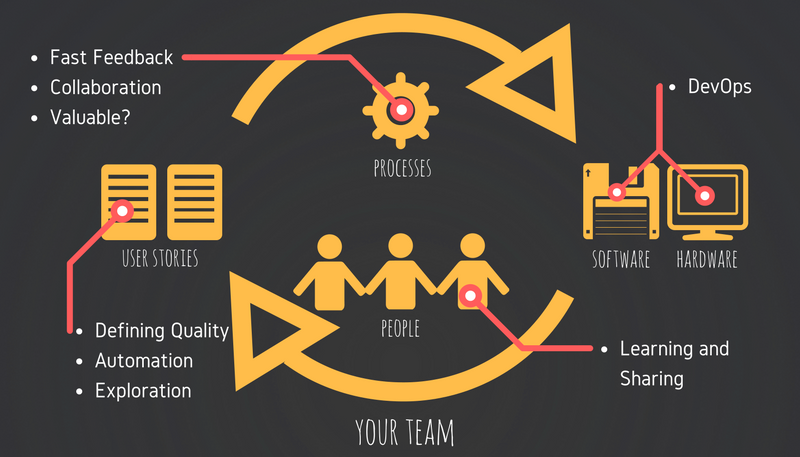

## How To Build Quality In (Everywhere)

### Introduction

I was recently asked what I see my role is in the Quality Assurance field.  I often see other QAs (Test Analysts, Test Engineers, Quality Analysts, Quality Engineers, etc.) in the industry restricting themselves to only caring about the quality of individual user stories, and in the rare case this may extend to caring about the overall software that is being delivered.  This is of course could be due to a number of limitations such as inexperience, bandwidth or even from a lack of interest.  

I feel that as a QA, there is so much more to offer, and that you can be an advocate of quality for not only user stories and software, but also the hardware, people and processes that are required to deliver the final product.  I feel that we can contribute on a larger scale than just within the team, whether it be internal or external to the organisation that you are employed at.  In this post, I will attempt to briefly describe the things I care about.

### Your Team

Your team is the first place where you can be an advocate for all things quality.  This is where everything that you do contributes to high quality products.  In order to achieve this, we must look at User Stories, Processes, People as well as Software and Hardware.

{: .center-image }

##### User Stories

* Define Quality
* Automation
* Exploration

##### Processes

* Fast Feedback
* Collaboration
* Valuable?

##### People

* Learning
* Sharing
* Innovating

##### Software and Hardware

* DevOps

### Your Organisation

Next, your organisation is a place where you can learn and share what other areas are doing in the Quality Assurance field.

{: .center-image }

* Awareness
* Learning
* Sharing
* Innovating

### Your Community

Next, your community is a place where you can learn and share what other organisations are doing in the Quality Assurance field.  It is a place where you can see learn from a diversity of industries and backgrounds, but it also gives you the arena to strive to be the best in your craft.

{: .center-image }

* Curiosity
* Growing
* Learning
* Sharing

### Full Infographic

{: .center-image }
